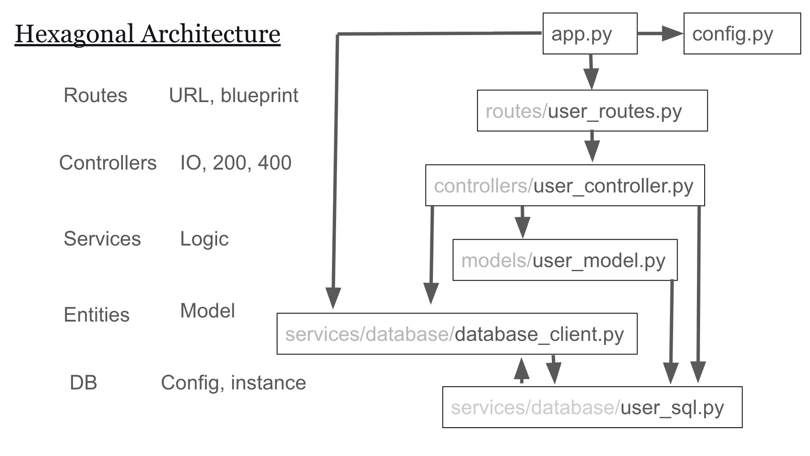

# data6580_hw

## Setting
```zsh
git clone -b feature https://github.com/hikaru-izumitani/data6580_hw.git
```
Set a virtual environment of Python
```zsh
python -m venv .venv
```

Then, use the virtual environment of Python
```zsh
source .venv/bin/activate
```
Setup Python packages

```zsh
pip install -r requirements.txt
pip install Flask-SQLAlchemy
```


## Run
```zsh
python -m data5580_hw.app
```

